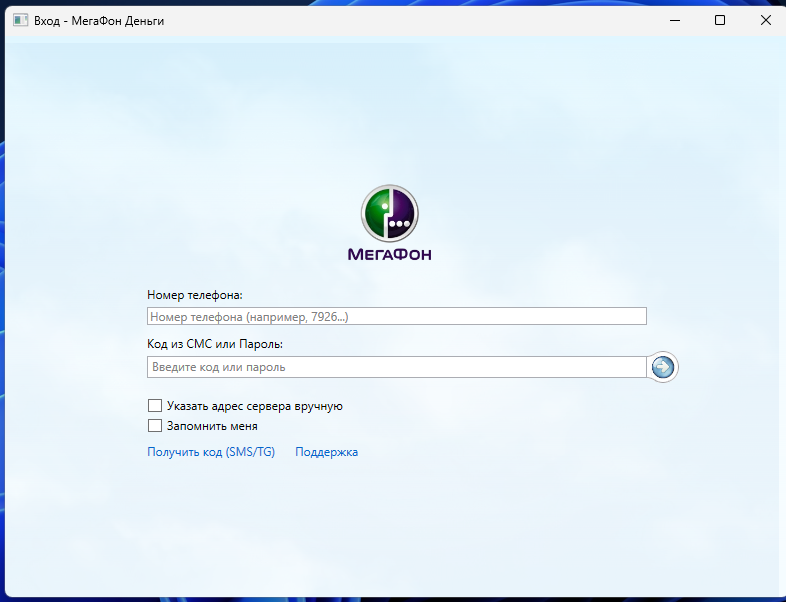

# LonghornMoney
A third-party Megafon Money client with a Windows Longhorn theme.  
    
    
     

## Credits
- DoofusMcGoofus - Original programming, Design  
- MondySpartan - Original Concept  
- Samsung - Sound Design (Longhorn Sound Scheme)  
